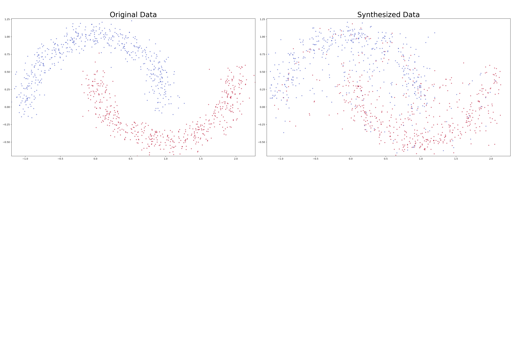
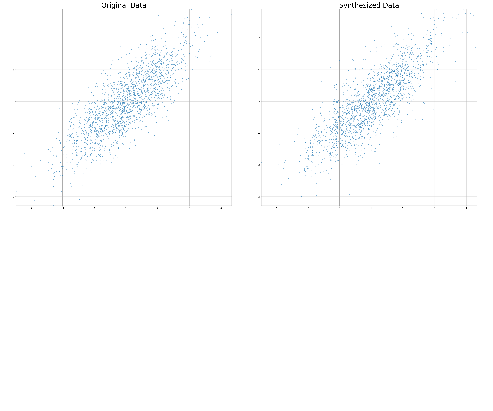

# arf-js

`arf-js` is a JavaScript/TypeScript implementation of **Adversarial Random Forests (ARF)** for tabular synthetic data generation.

Paper: https://arxiv.org/abs/2205.09435

It is designed to run in Node.js and browser environments. Because it can run in-browser, you can build a fully static web app (for small datasets) where data stays on the user’s machine.

## What This Repo Contains

- ARF core training loop
- FORDE-style leaf-wise parameter fitting
- FORGE sampling from trained ARF models
- TypeScript API (`fit`, `sample`, `fitSample`)
- tests and runnable example workflows

## Install

```bash
npm install
```

For development:

```bash
npm run typecheck
npm test
npm run build
```

## Quick Usage

```ts
import { fit, sample } from "arf-js";

const rows = [
  { x1: 1.2, x2: 3.4, cls: "A" },
  { x1: 1.5, x2: 3.1, cls: "B" },
  { x1: 0.9, x2: 2.8, cls: "A" },
];

const schema = {
  x1: "numeric",
  x2: "numeric",
  cls: "categorical",
};

const model = fit(
  { rows, schema },
  {
    seed: 2026,
    maxIterations: 10,
    useOobAccuracy: true,
    missingPolicy: "reject", // or "impute"
  },
);

const synthetic = sample(model, rows.length, 2026);
console.log(synthetic);
```

## API

- `fit({ rows, schema }, options?) -> model`
- `sample(model, n, seed?) -> rows`
- `fitSample({ rows, schema }, n, options?) -> rows`

### Input Contract

- `rows`: array of plain JS objects
- `schema`: explicit per-column type map:
  - `"numeric"`
  - `"categorical"`

Missing values are controlled by `missingPolicy`:
- `"reject"` (default)
- `"impute"`

## Example Workflows

```bash
npm run examples:twomoons
npm run examples:digits
npm run examples:mvnorm
npm run examples:titanic
npm run examples:penguins
npm run examples:all
```

More details: [examples/README.md](examples/README.md)

## Sample Outputs

### Two Moons (Real vs Synthetic)



### MVNorm (Real vs Synthetic)


